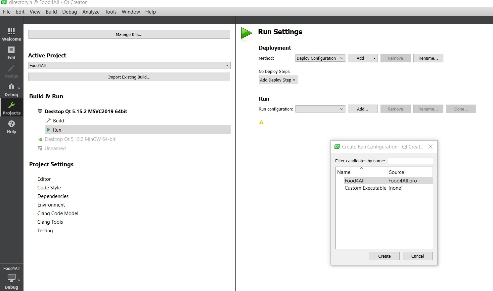
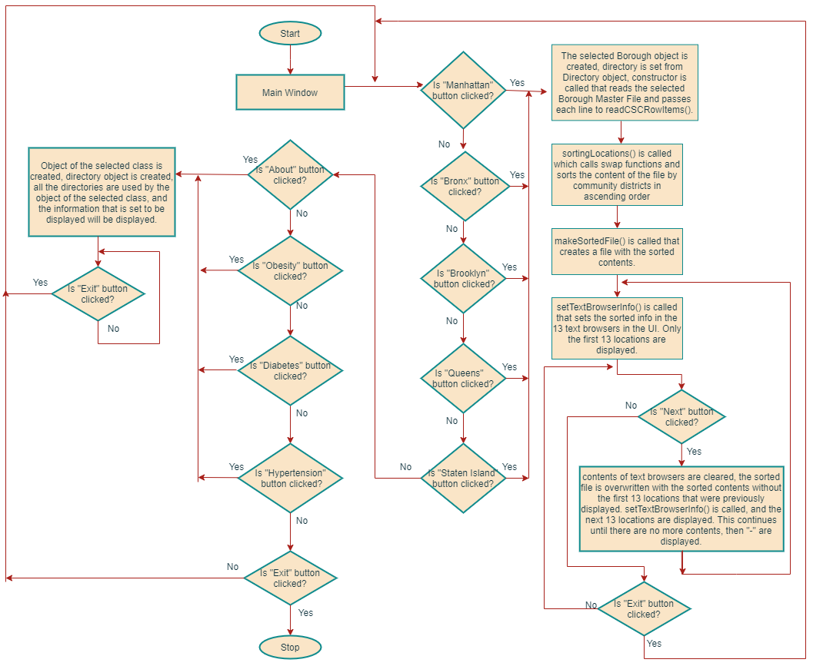
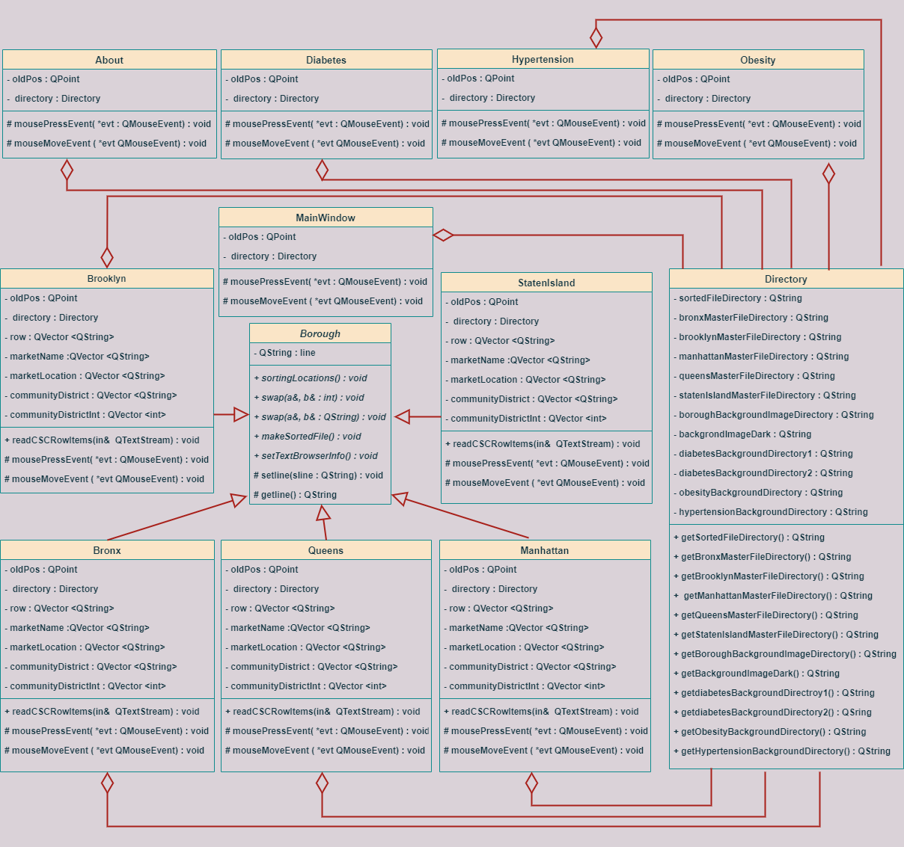

# Food4All

Food4All NYC is an application that can act as a resourse for lower inclome families of NYC to access healthier food options with SNAP EBT benefits. It is a desktop app built with QT Framework and C++11.

The intention of this app is to make lower income families of NYC aware of the various resources that are out there to access healthier food options to lead a healthier lifestyle, and avoid long-term and harmful diseases that come with consuming unhealthy junk food.

This app is developed from scratch by Mir Afra Humaira, under the supervision of Dr. Azhar as an Honor's Project for the course CSC211H Advanced Programming Techniques. 

Link to website: https://bit.ly/3onZ8WK

# Inspiration for Food4All
In an expensive city like New York, food security is a major issue for lower income residents. Unhealthy food options are promoted more, and are cheaper than healthier food options like fruits and vegetables. Food4All is an app that acts as resource to lower income New Yorkers to find affordable food options by displaying locations of Farmers' Markets that accept SNAP EBT. Information on prevalent diseases caused by consuming unhealthy food are also provided, and how they can be prevented/controlled by healthy eating.

# Project Description

This app contains information about the nutritional values of consuming fruits and vegetables and how they can help with the dangerous health issues like Diabetes, Obesity, Hypertension. Locations and names of Farmers' markets that accept SNAP EBT as payments are also provided. The locations are visualized from smallest to largest Community District numbers.

If one is unaware of their community district number, a link to Beta NYC's boundaries map is provided, from where the user can look up any address within NYC and find the community district for it.

Link to video: https://youtu.be/AXlynQbBL6o

# How to use the App

## Download and install QT

At first, you would have to download QT Framework from their website: https://bit.ly/3osHUr8. Follow the instructions to install version 5.15, and MSVC 2019 64-bit installer.

## Changes in the directory

Once QT is download and installed, open the Food4All.pro file in the 'src' folder for Food4All folder, and go to Sources --> directory.h file. 

Double check debug and make sure the app runs:

Change the directories of the master files (in the 'files' folder) and the images (in the 'media' folder) to the specific directory of the Food4All folder you have download from git. 

Make sure to follow the back and front slash patterns as given already in the original directory.h file.
These are the only changes you would need to make to run this app. 

If, by any chance, one or more directory paths you have set are not working, exceptions with specific file/function infos will be thrown in the console for guidance.

# Algorithm of Food4All

# Software Design of Food4All (UML)

# Challenges

* Learning QT Framework was a challenge since the syntax is different from what we are used to for C++. However, reading the API helped a lot, and video references from youtube, and stacks-overflow answers were of tremendous help. Last but not the least, trial and error for certain things (especially pointers to vectors) was an interesting way to learn how to implement what I wanted to implement.

* My algorithm includes using a lot of directories. In total, I have about 35 directories in my entire project that includes directories from files, and images used in the app.   I had to change my working pc to another due to charging issues after I was 80% done with the code. After having installed QT in my current pc, and then trying to run my app,   I realized how tedious it is to have to go to each class and manually change all the 35 directories, and having to double check if they were the correct directories. 

  Therefore, I made a directory class that has all the directories from the app, and all the other classes in the app has a directory object in them. So, all the other classes     can call the specific functions from the directory class to have access to the directories needed by them. And if I have to run this app in a new pc, I’d just have to copy       paste the directories 12 times only in the 1 class, instead of having to repeat the process 35+ times in 12 different classes. I also made my exception  handling throws         detailed, so if one certain directory is wrong, the error message would tell you exactly which file and function to look at (and you can see which directory function is used,   and correct it in the directory class).

* After making the window and dialogues “frameless”, it was immovable, so a stacks -overflow answer was helpful. The credit is given as a comment in the code everywhere that specific code was used.

# Accomplishments:

* Succesfullly incorporated all major advanced programming techniques learnt in my 211H class.
* Learnt QT framework and QT API

# Future direction: 

I would like to create a map with the Farmers' Market locations plotted in it and link it in the app.

